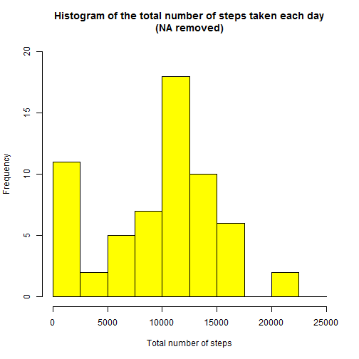

## Loading Data

First we need to load csv file in data variable (Reader should set working directory before starting):

```r
setwd("F:/Online Courses/Reproducible Research/Porject 1/repdata_2Fdata%2Factivity")
data<-read.csv("activity.csv")
```


## Preprocessing of data

Change date format into date 

```r
data$date<-as.Date(data$date)
```
## Histogram without NA values

Histogram of total number of steps taken on each day is shown below:


```r
sum_steps<-aggregate(data$steps,by=list(data$date),FUN=sum,na.rm=TRUE) 

hist(sum_steps$x, 
      breaks=seq(from=0, to=25000, by=2500),
      col="yellow", 
      xlab="Total number of steps", 
      ylim=c(0, 20), 
      main="Histogram of the total number of steps taken each day\n(NA removed)")
```




## Mean and Median of Steps

Mean and median number of steps taken each day

```r
mean(sum_steps$x)
```

```
## [1] 9354.23
```

```r
median(sum_steps$x)
```

```
## [1] 10395
```
## Time Series Plot

Time series plot of the average number of steps taken

```r
avg_steps<-aggregate(data$steps,by=list(data$interval),FUN=mean,na.rm=TRUE)

colnames(avg_steps)<-c("interval","steps")

library(ggplot2)
```

```
## Warning: package 'ggplot2' was built under R version 3.3.2
```

```r
ggplot(aes(x=interval,y=steps),data=avg_steps)+geom_line()
```


## Maximum Average 5 minute interval

The 5-minute interval that, on average, contains the maximum number of steps

```r
avg_steps[avg_steps$steps==max(avg_steps$steps),1]
```

```
## [1] 835
```

## Imputing NA

#### Here is code to describe and show a strategy for imputing missing data

Calculate and report the total number of missing values in the dataset (i.e. the total number of rows with NA's)

```r
sum(is.na(data$steps))
```

```
## [1] 2304
```


Replace NA values with the mean of the steps

```r
data$steps[is.na(data$steps)]<-mean(data$steps,na.rm=TRUE)
```
Here are some rows of new data set

```r
head(data)
```

```
##     steps       date interval
## 1 37.3826 2012-10-01        0
## 2 37.3826 2012-10-01        5
## 3 37.3826 2012-10-01       10
## 4 37.3826 2012-10-01       15
## 5 37.3826 2012-10-01       20
## 6 37.3826 2012-10-01       25
```
## Histogram with Repaced NA values

Histogram of total number of steps taken on each day is shown below:


```r
sum_steps<-aggregate(data$steps,by=list(data$date),FUN=sum,na.rm=TRUE) 

hist(sum_steps$x, 
      breaks=seq(from=0, to=25000, by=2500),
      col="yellow", 
      xlab="Total number of steps", 
      ylim=c(0, 30), 
      main="Total number of steps taken each day\n(NA replaced by mean)")
```


Mean and median number of steps taken each day after replacing NA values with mean

```r
mean(sum_steps$x)
```

```
## [1] 10766.19
```

```r
median(sum_steps$x)
```

```
## [1] 10766.19
```
##  Differences in activity patterns between weekdays and weekends

Panel plot comparing the average number of steps taken per 5-minute interval across weekdays and weekends

```r
# Convert date into weekdays

data$days=tolower(weekdays(data$date))

#Now categorised days into weekend and weekdays

data$day_type<-ifelse(data$days=="saturday"|data$days=="sunday","weekend","weekday")

#Take mean steps taken on weekend or weekday in the intervals

avg_steps<-aggregate(data$steps,by=list(data$interval,data$day_type),FUN=mean,na.rm=TRUE)

colnames(avg_steps)<-c("interval","day_type","steps")

# Create panel plot between average steps and interval seperated by day type

ggplot(aes(x=interval,y=steps),data=avg_steps)+geom_line()+facet_wrap(~avg_steps$day_type)
```


